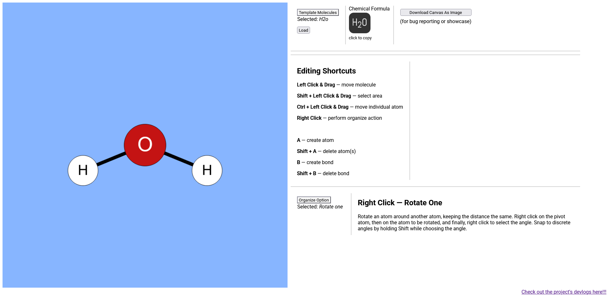
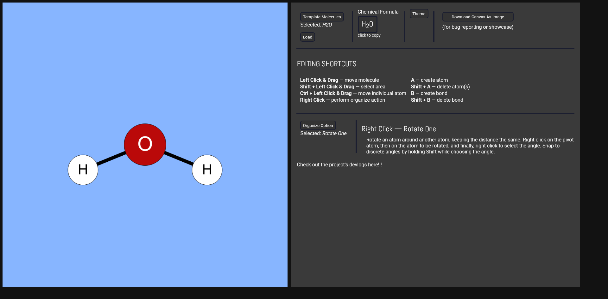

## Devlog #15 - 11/14/2025
# Keeping Appearances

#### What a pretty mole!

I got a great piece of feedback after my last few updates—make the site look better! So I did.  
I added a light mode and a dark mode, which you can switch between with the dropdown to the right of the chemical formula.

Things look a lot different now (and a lot better), so let's see a comparison!

Before:

After:

It looks different in light mode, of course.

 
 

Now you can keep making compounds even late at night!

[<-- Previous Devlog](DEVLOG_14.md)   [Next Devlog -->](DEVLOG_16.md)