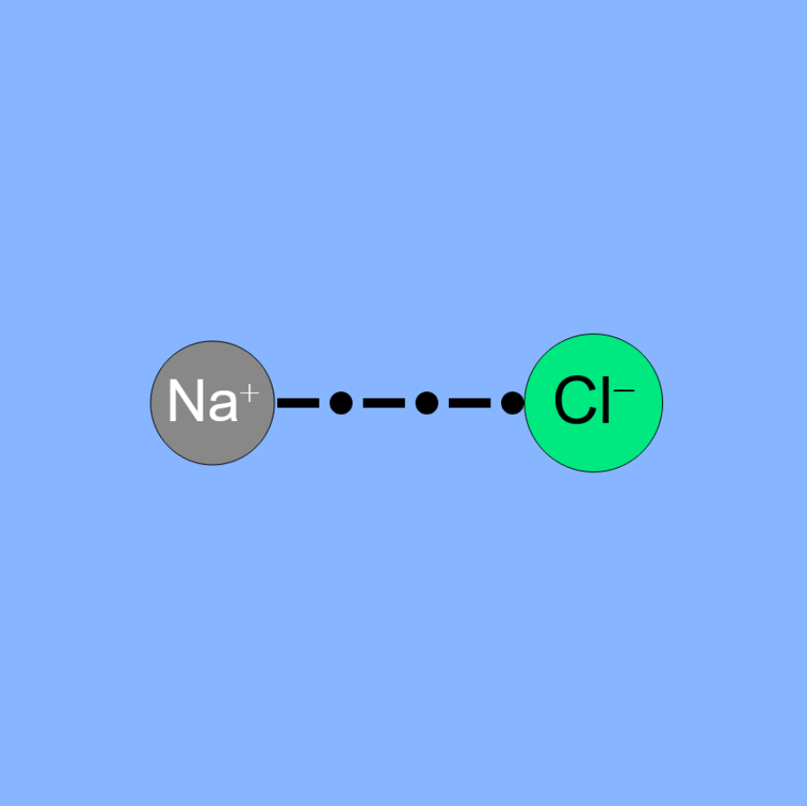
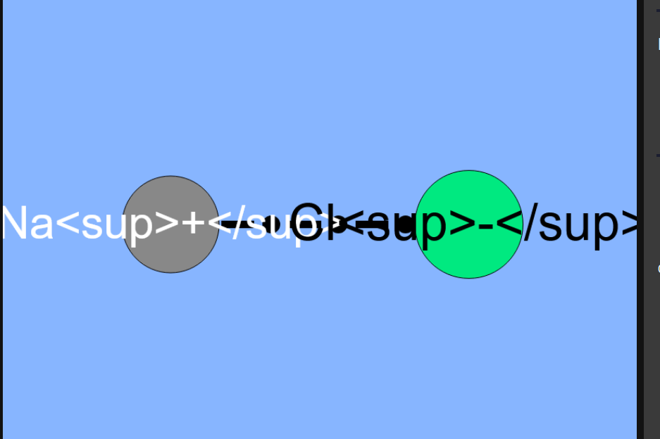

## Devlog #16 - 11/15/2025
# Charging Up

#### Phew, it was at 1%!

Covalent bonds aren't the only type of bonds, which is why I have to do more coding...

But here they are, ionic bonds! Make acids and stuff by donating atoms! The first atom you select will be the donor and the second will be the recipient.

I had some hiccups along the way, including this very funny problem:

It kinda looks like the chlorine has a face lol

I also made some other small requested changes, like making it so that you can use left or right clicks while in organizing mode.
The other changes are just fixes that make things nicer.

 
 

Don't make anything dangerous!

[<-- Previous Devlog](DEVLOG_15.md)<!--   [Next Devlog --\>](DEVLOG_16.md)-->