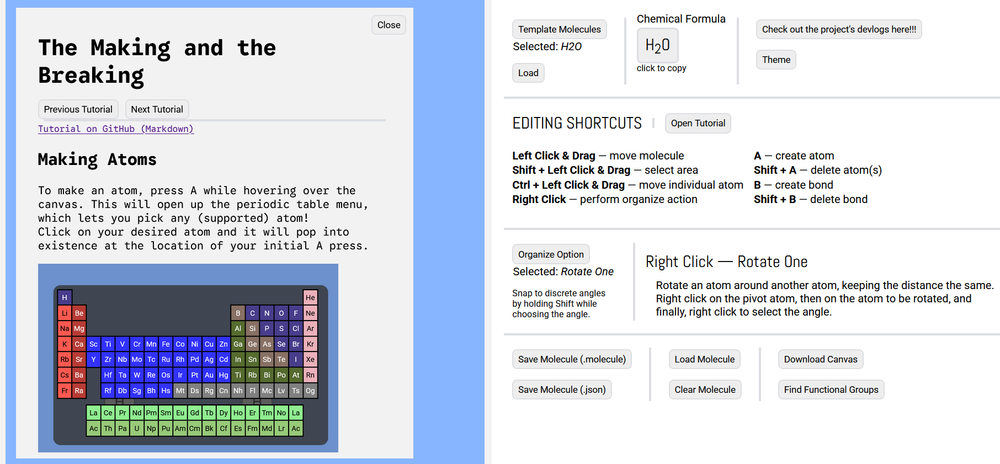

## Devlog #21 - 12/31/2025
# Chemistry Class

#### Science can be confusing...

I was shown that my program DESPERATELY needs some tutorials or something, because it's very confusing to use. So I made one!

## Making the Thing

I started by making a panel that can show up from the left. It looked like this when it didn't have anything on it.  

Then, I populated it with all of the necessary info.
- Adding and deleting atoms
- Adding and deleting bonds
- Moving, undoing, and redoing
- Using the orientation tools
- Finding functional groups and formulae

## JS Tutorial Loading System

I made some JS code that loads a tutorial into the tutorial panel from an HTML file. I then used this code to make buttons that allow you to switch between them, going to the next or previous tutorial.  
Finally, I made a button on the website which opens the tutorial panel.

 
 

Have fun not being confused, and see you next time!

[<-- Previous Devlog](DEVLOG_20.md)<!--   [Next Devlog --\>](DEVLOG_22.md)-->