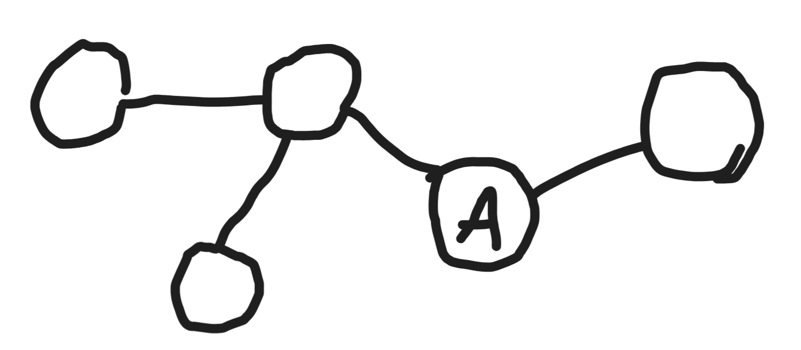
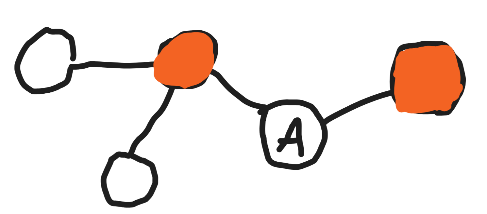
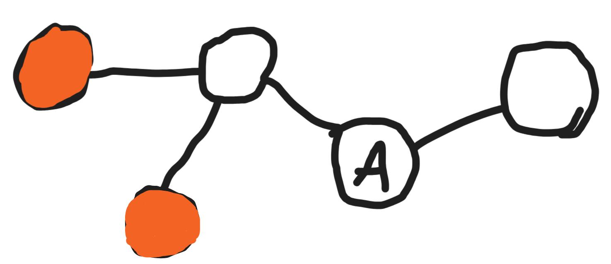

## Devlog #8 - 11/8/2025
# Chain Reaction

#### Hope it's not the nuclear kind!

For multiple applications in this project, I need to be able to find every atom connected to one. I imagine the process of finding it like this:

1. Get the atom you want to find the surroundings of.


2. Find the neighbors of that atom (I have a function for that already!)


3. Find the neighbors of THOSE atoms and add them to the list if they're not in it already.


4. Repeat however many times required.

And that's the tricky part. How do you know when to stop it? Well, just stop recursing whenever every neighbor of every probed atom is already accounted for!

## Implementation
Here's my function for this!
```js
findAllConnected(atomId) {
    const allConnected = [atomId];
    
    let sampleAtoms = this.findNeighborIndices(atomId);
    let predicate = sampleAtoms.reduce((pc, aid) => pc || !allConnected.includes(aid), false);
    while (predicate) {
        const unfound = sampleAtoms.filter(aid => !allConnected.includes(aid));
        allConnected.push(...unfound);

        sampleAtoms = unfound.map((aid) => this.findNeighborIndices(aid)).flat();
        console.log(sampleAtoms);
        predicate = sampleAtoms.reduce((pc, aid) => pc || !allConnected.includes(aid), false);
    }

    console.log(allConnected);
    return allConnected;
}
```

Pretty cool, right? Now, when you move the stuff around, only the connected part will move.

<br>
<br>

This change will make things easier to use!

[<-- Previous Devlog](DEVLOG_7.md)   [Next Devlog -->](DEVLOG_9.md)