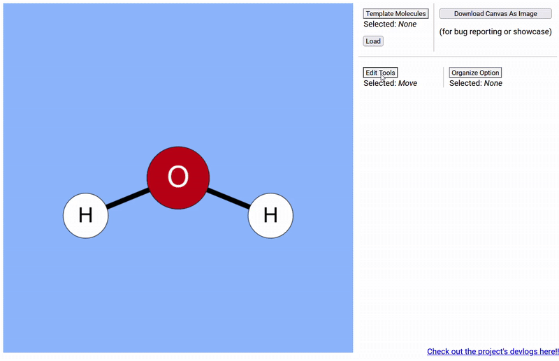

## Devlog #9 - 11/8/2025
# The Axiom of Choice

#### Set Theory jumpscare!

OK, so the title is a bit misleading. I don't actually have infinitely many atoms to choose from. =L

But I do have like 8! Here's a demonstration.



Making the dropdown appear where you click was kinda tricky to get working, but it's great now!

I also made it so you can't make bonds that couldn't exist in real life; e.g., H3. Yeah, hydrogen can only have one covalent bond.  
Here's the simple fix:

```js
if (degree > this.atoms[atomId1].valence || degree > this.atoms[atomId2].valence) {
    alert("One or more of those molecules are already full.");
    return;
}
```

<br>
<br>

Have fun making molecules, and see you next devlog!

[<-- Previous Devlog](DEVLOG_8.md)<!--   [Next Devlog --\>](DEVLOG_10.md)-->