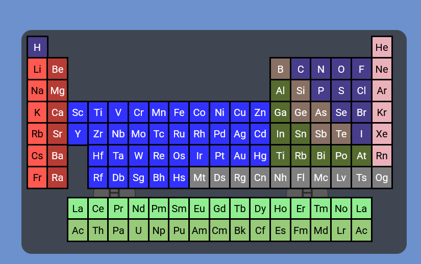
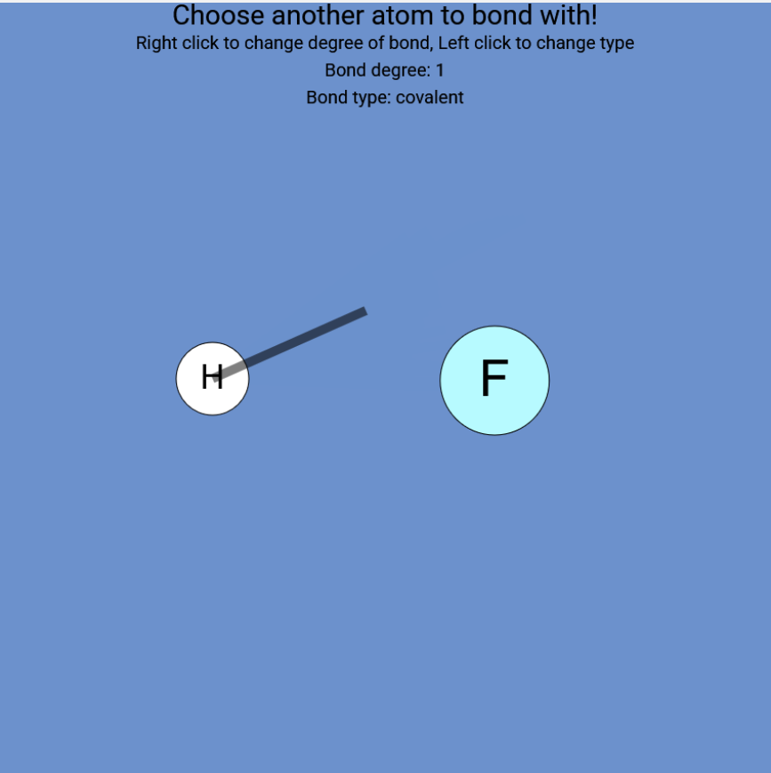

# The Making and the Breaking
[<-- Previous Tutorial](./TUTORIAL.md)   [Next Tutorial -->](./ORIENTATION.md)

### Making Atoms

To make an atom, press A while hovering over the canvas. This will open up the periodic table menu, which lets you pick any (supported) atom! Click on your desired atom and it will pop into existence at the location of your initial A press.  

### Making Bonds

Once you have two atoms, you can bond them! Press B while hovering over an atom. This will initiate ***bonding mode***! At this point you can change the order or the type of the bond; the controls for those are written on-canvas when bonding.  

### ~~Brownian~~ Motion

To move your molecule, simply left click and drag any atom of it. Any connected atoms will move along with whichever one you drag. Unconnected ones won't be phased. If you want to move a single atom independently of the others, hold Control while dragging the atom.  

### Breaking Atoms & Bonds

Now that we have atoms, let's destroy them!  
Press Shift+A while hovering over an atom to get rid of it. Doing this will also destroy any bonds made with the atom.  
What if you want to get rid of a bond? Do the same thing. Hover over a bond (the black line) and press Shift+B. This will destroy the bond, but not the atoms involved.

### Selecting Multiple Atoms

If you want to move some atoms, but not all the connected ones, you can select only some by holding Shift and left clicking and dragging. This allows you to select every atom within a rectangular area.  
From here, you can move them by simply holding Ctrl and clicking and dragging like usual.

You can press Shift+A to delete all of the atoms selected, or you can press Shift+B to delete every bond between the atoms you've selected.

### Undo and Redo

Chemistry is hard. If you make a mistake, press Ctrl+Z to undo your last change.  
If you change your mind, press Ctrl+Y or Ctrl+Shift+Z to redo that undoing.

 
 

[<-- Previous Tutorial](./TUTORIAL.md)   [Next Tutorial -->](./ORIENTATION.md)